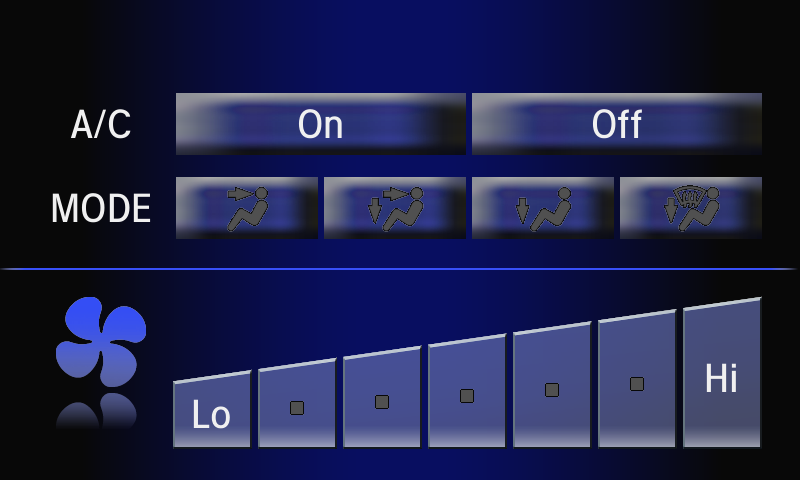
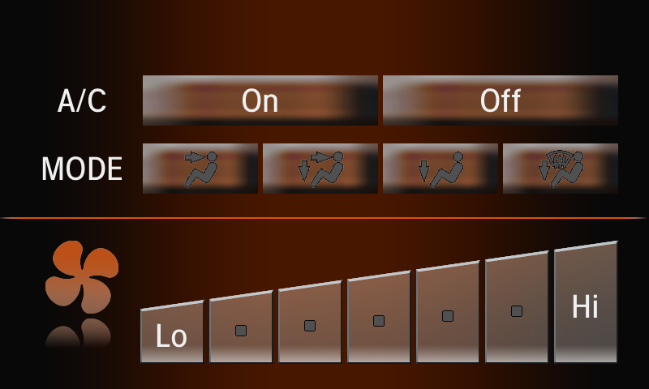
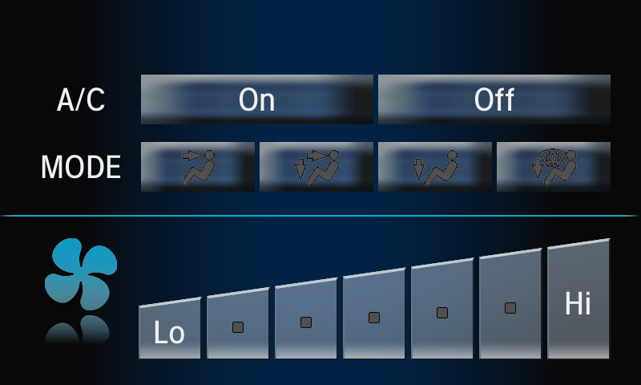
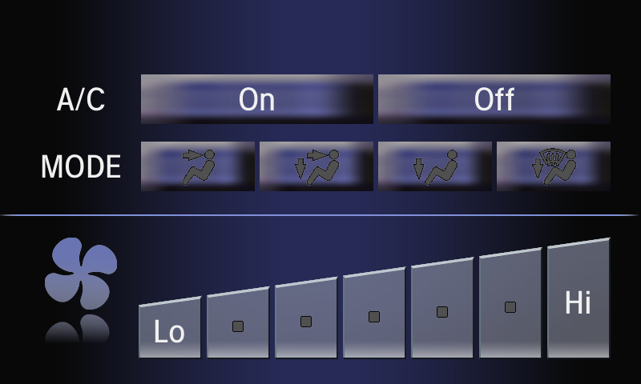
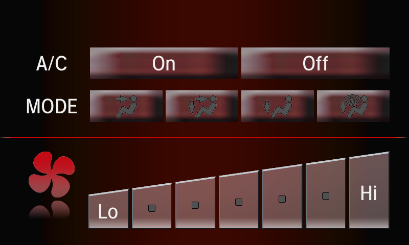
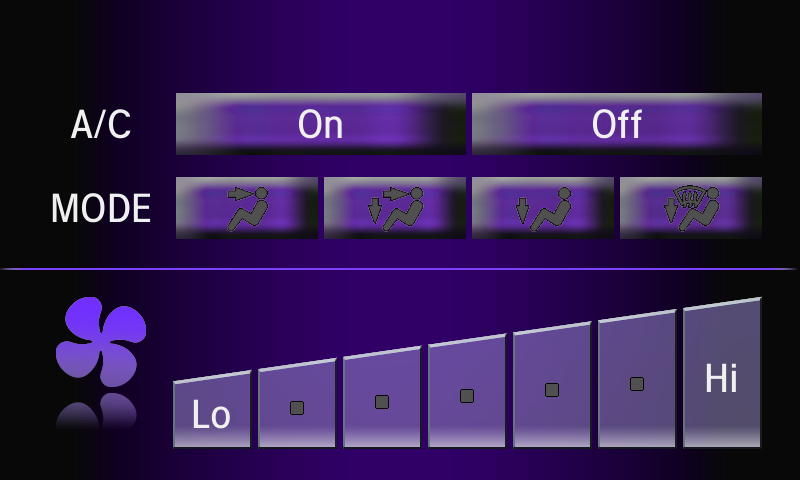

# apk-renderer

Map layouts from Honda/Mitsubishi APKs to PNG images.

The goal is to visually grep the different layouts a given Honda app makes available, without needing the Android runtime or underlying Java classes.

> [!WARNING]
> Not production quality. Most of the rendering pipeline is heavily AI-written. This is a hacky experiment. To be clear, AI was used for the implementation of the rendering pipeline logic, not information. The authors believe the information in this README.md to be mostly correct.

The ability to render activities from Honda APKs yields a few immediate benefits. In practice, the static rendering provided here does not achieve all of these:
- Make reverse-engineering easier by cataloging known activities and layouts
- Introduce canonical names for common activities and layouts
- Allow community members to link to screenshot-like PNGs in documentation
- Visually document the existence of hidden or diagnostic activities
- Make it easier to create OEM-like custom themes (e.g., pink instead of blue)

## Setup

```sh
uv sync
```

## Usage

Render single layout .xml file:
```sh
uv run render \
  --framework-dir ../apk-rebuilder/output/apktool-framework \
  --app-dir ../apk-rebuilder/output/apktool-apps/AirCon \
  --xml-file ../apk-rebuilder/output/apktool-apps/AirCon/res/layout/mm_52_01_01.xml \
  --fonts-dir ../apk-rebuilder/output/unzipped-mdt/system/fonts/ \
  --system-fonts-file ../apk-rebuilder/output/unzipped-mdt/system/etc/system_fonts.xml \
  --fallback-fonts-file ../apk-rebuilder/output/unzipped-mdt/system/etc/fallback_fonts.xml \
  --output-file output.png
```

Optional flags:
- `--width` (default 800)
- `--height` (default 480)
- `--density` (default 1.0)
- `--font-scale` (default 1.0)
- `--theme` (default ThemeBlue)

Render all layouts across all apps:
```sh
uv run bulk-render \
  --framework-dir ../apk-rebuilder/output/apktool-framework \
  --apps-dir ../apk-rebuilder/output/apktool-apps \
  --fonts-dir ../apk-rebuilder/output/unzipped-mdt/system/fonts \
  --system-fonts-file ../apk-rebuilder/output/unzipped-mdt/system/etc/system_fonts.xml \
  --fallback-fonts-file ../apk-rebuilder/output/unzipped-mdt/system/etc/fallback_fonts.xml \
  --output-dir ./output
```

## Themes

The framework resources are a combination of stock AOSP 4.2.2 themes and Mitsubishi vendor-specific additions. The standard Android themes (Holo, DeviceDefault, etc.) are present as expected. On top of those, Mitsubishi adds a set of custom themes: six color variants that share a common `ThemeBaseHgw` parent, plus a separate `ThemeZiba` skin.

| Theme | Translucent parent | Base |
|---|---|---|
| ThemeBlue | ThemeBlueTranslucent | ThemeBaseHgw |
| ThemeAmber | ThemeAmberTranslucent | ThemeBaseHgw |
| ThemeBlueGreen | ThemeBlueGreenTranslucent | ThemeBaseHgw |
| ThemeGray | ThemeGrayTranslucent | ThemeBaseHgw |
| ThemeRed | ThemeRedTranslucent | ThemeBaseHgw |
| ThemeViolet | ThemeVioletTranslucent | ThemeBaseHgw |
| ThemeZiba | ThemeZibaTranslucent | AppBaseTheme |

The full theme inheritance hierarchy, rooted in stock AOSP themes, is shown below. The stock themes can be found in the AOSP 4.2.2 source at [`frameworks/base/core/res/res/values/themes.xml`](https://android.googlesource.com/platform/frameworks/base/+/refs/tags/android-4.2.2_r1/core/res/res/values/themes.xml).

```
Theme (AOSP)
└── Theme.Translucent (AOSP)
    └── AppBaseTheme
        ├── ThemeBaseHgw
        │   ├── ThemeAmberTranslucent
        │   │   └── ThemeAmber
        │   ├── ThemeBlueTranslucent
        │   │   └── ThemeBlue
        │   ├── ThemeBlueGreenTranslucent
        │   │   └── ThemeBlueGreen
        │   ├── ThemeGrayTranslucent
        │   │   └── ThemeGray
        │   ├── ThemeRedTranslucent
        │   │   └── ThemeRed
        │   └── ThemeVioletTranslucent
        │       └── ThemeViolet
        └── ThemeZibaTranslucent
            └── ThemeZiba
```

## Examples

The AirCon app's `mm_52_01_01` layout rendered with each Mitsubishi color theme:

| Theme | Render |
|---|---|
| ThemeBlue |  |
| ThemeAmber |  |
| ThemeBlueGreen |  |
| ThemeGray |  |
| ThemeRed |  |
| ThemeViolet |  |

## Accuracy and Limitations

The renderer aims to faithfully replicate Android 4.2.2's view inflation logic. It uses the same three-pass pipeline as the real Android 4.2.2 framework (measure, layout, and draw). Resource resolution also aims to match Android behavior, including theme attributes and style inheritance. That said, while it's a goal, accuracy isn't guaranteed and behavior is not one-to-one.

Some layouts will render as blank or empty images. This is expected; many layouts are composed mostly of invisible elements whose visibility would normally be toggled at runtime by Java code. For the stated goal of visual grepping to understand the APKs, this is a limitation of a fully-static approach.

FrameLayouts with multiple visible children (commonly used as tab containers) only render their first visible child. On the real device, a Java controller would hide inactive tabs at runtime; since we render statically, showing only the first child is the closest approximation.

The APKs reference several Mitsubishi-specific view classes that don't exist in stock Android. The renderer includes stub implementations for some of them. These implementations are reasonable guesses based on the class names and how they're used in layouts. A more accurate implementation would involve looking at baksmali'd Java code.

The renderer's core measure/layout/draw pipeline is interleaved with Mitsubishi-specific custom view types. Ideally these would be separate concerns, where the rendering core would be vendor agnostic, and vendor-specific view types would be added on top. In practice, a strict separation is out of scope.

## Alternatives

[Paparazzi](https://github.com/cashapp/paparazzi) runs `layoutlib` (the actual Android rendering engine) on the JVM without needing an emulator. It would be a better fit than a custom renderer:

- Improved accuracy via the actual layout engine
- Programmatic view and visibility control
- Existing maintained project

But it would take work to get running:

- Paparazzi is a Gradle plugin; decomped resources need to be wired into a Gradle project
- Mitsubishi-specific view classes need stubs on the classpath
- Non-standard theme attributes need to be wired up

## Legal Notice
I'm not affiliated with Honda Motor Co., Ltd. I'm not affiliated with Mitsubishi. Honda and Honda Civic are registered trademarks. This is for personal use only. I can't condone software piracy.
